# Lab 1: The OS as a Resource Manager

**Student:** _Name Surname_, FAF-24x
**Track:** A (Linux) on an Ubuntu 24.04.3 ARM64 VM (Parallels, Apple Silicon)

## Setup

```
$ whoami
parallels
$ uname -a
Linux ubuntu-gnu-linux-24-04-3 6.14.0-27-generic #27~24.04.1-Ubuntu SMP PREEMPT_DYNAMIC Tue Jul 22 17:18:30 UTC 2 aarch64 aarch64 aarch64 GNU/Linux
$ uptime
 17:34:46 up 8 min,  1 user,  load average: 0.06, 0.07, 0.01
```

The machine runs Linux kernel 6.14 on an ARM64 (`aarch64`) CPU.

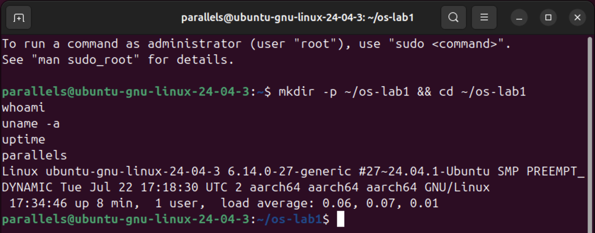

---

## Part 1. Files and directories

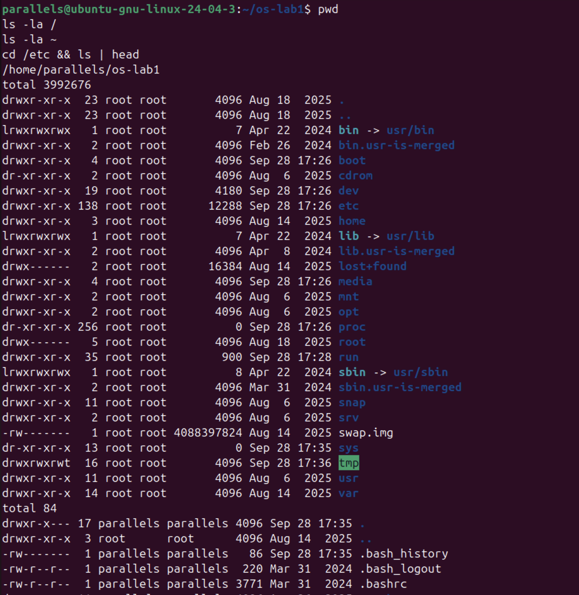

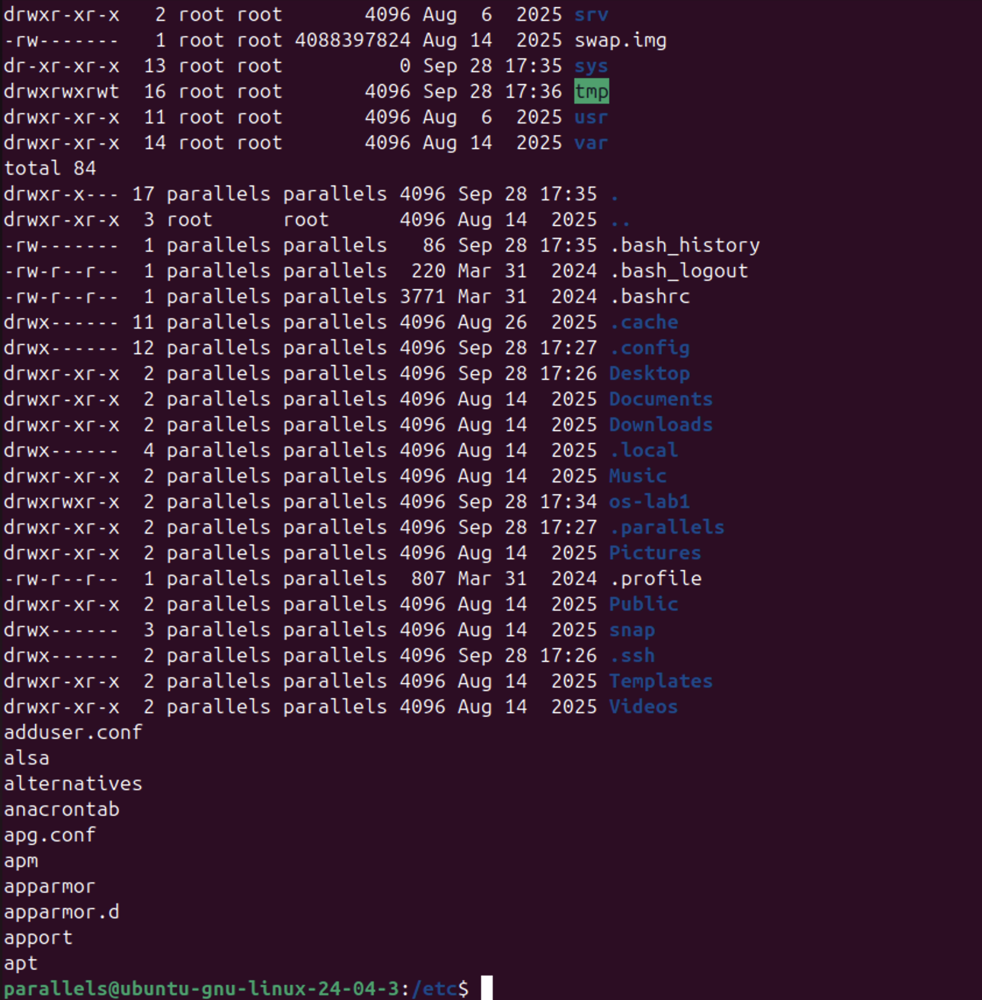

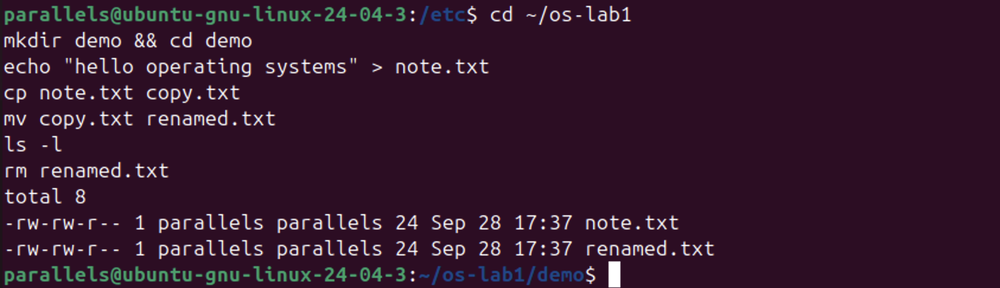

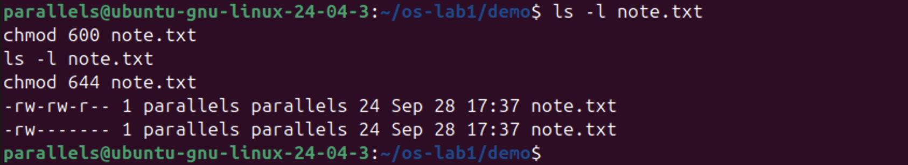

**Interesting output:**
```
$ ls -l
total 8
-rw-rw-r-- 1 parallels parallels 24 Sep 28 17:37 note.txt
-rw-rw-r-- 1 parallels parallels 24 Sep 28 17:37 renamed.txt

$ chmod 600 note.txt && ls -l note.txt
-rw------- 1 parallels parallels 24 Sep 28 17:37 note.txt
```

**(1) Who owns the files, and which group?**
The files are owned by user `parallels`, and their group is also `parallels`. On Ubuntu, every user gets a private group with the same name as the user.

**(2) What do the ten characters mean after `chmod 600`?**
They are `-rw-------`:
- `-` means a regular file (`d` would mean a directory, `l` a symbolic link).
- `rw-` means the owner can read and write, but not execute.
- `---` means the group has no permissions.
- `---` means others have no permissions.

So only `parallels` can read or change `note.txt`. Before the chmod it was `-rw-rw-r--`: the group could also write, and others could read.

**(3) Two directories directly under `/`:**
- `/etc` holds system-wide configuration files, such as `adduser.conf`, `apt/` and `apparmor/`.
- `/home` holds users' personal directories (here, `/home/parallels`).

All top-level entries in `/` are owned by `root`, while everything inside `~` is owned by `parallels`. The OS separates system files from user files by ownership.

---

## Part 2. Processes

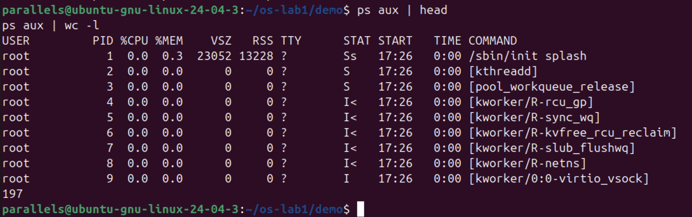

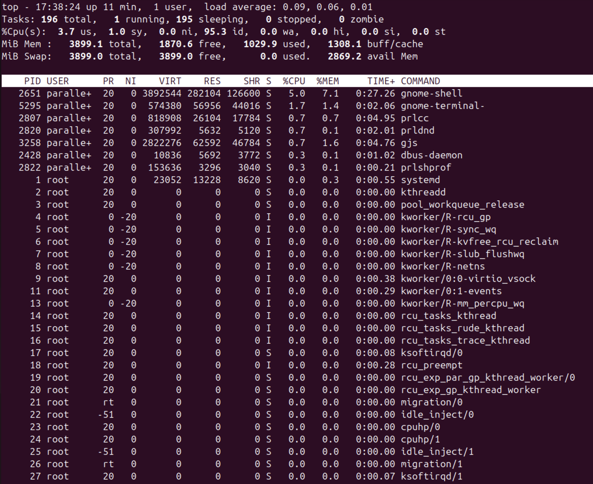

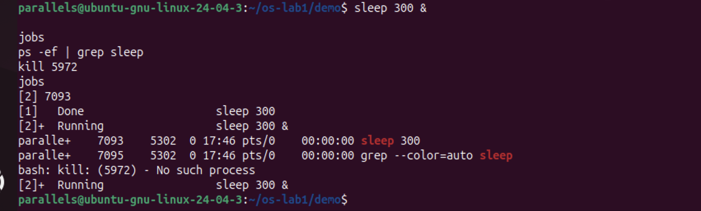

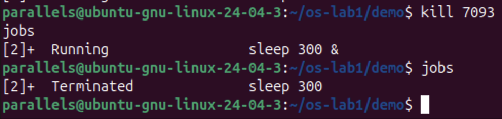

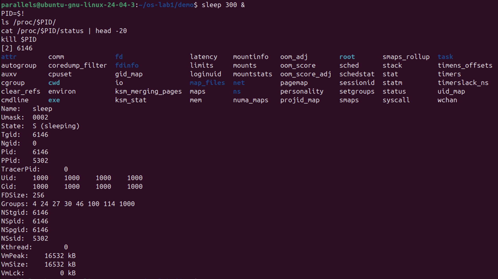

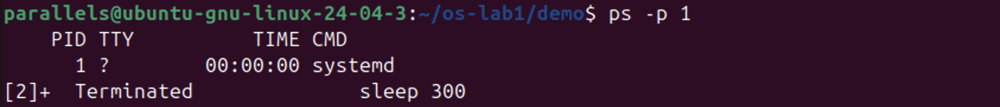

**Interesting output:**
```
$ cat /proc/$PID/status | head -20
Name:   sleep
State:  S (sleeping)
Pid:    6146
PPid:   5302
Uid:    1000    1000    1000    1000
VmPeak:    16532 kB
VmSize:    16532 kB
...
```

**Starting and killing a background process:**
```
$ sleep 300 &
[2] 7093
$ ps -ef | grep sleep
paralle+    7093    5302  0 17:46 pts/0    00:00:00 sleep 300
$ kill 7093
$ jobs
[2]+  Terminated              sleep 300
```

**(1) What is PID 1?**
PID 1 is `systemd`: `ps aux` lists it as `/sbin/init splash`, and `ps -p 1` shows `systemd`. It is the first user-space process the kernel starts at boot. It launches all other services, and it adopts orphaned processes.

**(2) How many processes on the idle VM?**
About 196. `ps aux | wc -l` printed 197, which includes one header line, and `top` showed `Tasks: 196 total, 1 running, 195 sleeping`. Many of them are kernel threads, such as `kthreadd` and the `kworker/...` threads.

**(3) What does `State:` say for the sleeping process?**
`State: S (sleeping)`. The process is waiting for its timer to expire and uses no CPU time until the kernel wakes it. Its `PPid` (5302) is my bash shell, which started it.

---

## Part 3. Memory

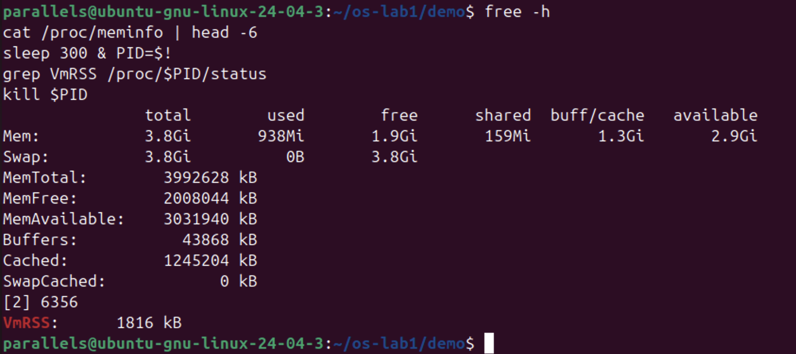

**Interesting output:**
```
$ free -h
               total        used        free      shared  buff/cache   available
Mem:           3.8Gi       938Mi       1.9Gi       159Mi       1.3Gi       2.9Gi
Swap:          3.8Gi          0B       3.8Gi
```

**(1) Total and free RAM:**
Total is 3.8 GiB (`MemTotal: 3992628 kB`). Free is 1.9 GiB, and available is 2.9 GiB. "Available" is higher than "free" because the kernel uses about 1.3 GiB as disk cache, and it can reclaim that memory when programs need it.

**(2) What is swap, and how much is configured?**
Swap is disk space the OS uses as overflow for RAM. When memory runs low, it moves pages that are rarely used out to disk. This VM has 3.8 GiB of swap, and 0 B of it is used. It is the file `/swap.img` that appears in `ls -la /`, about 4 GB and readable only by root.

**(3) VmRSS of `sleep`:**
`VmRSS: 1816 kB`, about 1.8 MB. That surprised me, since the program does nothing. Most of it is the shared C library (libc) and the dynamic loader mapped into the process. Those pages are shared with other processes, so they cost almost no extra physical RAM. The virtual size (`VmSize: 16532 kB`) is even larger, because most of that address space is reserved but never actually loaded into RAM.

---

## Part 4. Devices and storage

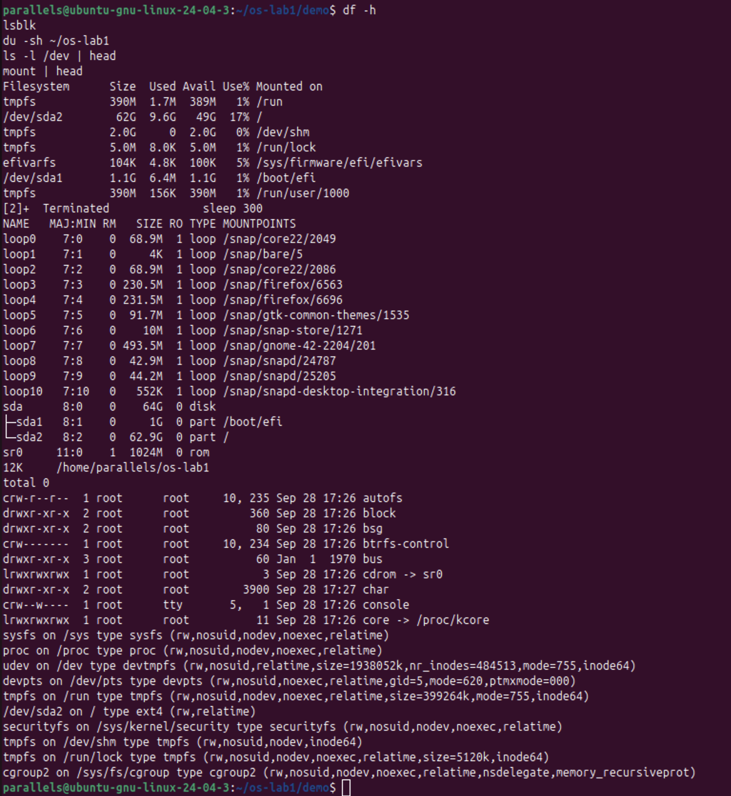

**Interesting output:**
```
$ lsblk
NAME   MAJ:MIN RM  SIZE RO TYPE MOUNTPOINTS
sda      8:0    0   64G  0 disk
├─sda1   8:1    0    1G  0 part /boot/efi
└─sda2   8:2    0 62.9G  0 part /
sr0     11:0    1 1024M  0 rom
```

**(1) Which device is `/` mounted on?**
`/dev/sda2`, an ext4 filesystem of 62 GB with 17% used (`mount` shows `/dev/sda2 on / type ext4`). The other partition, `/dev/sda1`, holds the EFI boot files at `/boot/efi`.

**(2) One entry from `/dev`:**
`/dev/cdrom` is a symbolic link to `sr0`, the VM's virtual CD/DVD drive. `/dev/sda` is the whole 64 GB virtual hard disk.

**(3) "Everything is a file":**
Disks (`/dev/sda`), the CD drive (`/dev/sr0`), the console, and even kernel memory (`/dev/core -> /proc/kcore`) all appear as files. That means ordinary tools like `ls` and `cat` can inspect hardware and the kernel.

---

## Closing synthesis

The OS manages four resources: files, processes, memory and devices.
- `ls -l` let me see files, with their owners and permissions.
- `ps aux` let me see processes; about 196 were running.
- `free -h` let me see memory: 3.8 GiB of RAM and 3.8 GiB of swap.
- `lsblk` let me see devices: the 64 GB disk `sda`, split into `sda1` and `sda2`.

---

## Screenshots index

1. [01-setup](screenshots/01-setup.png)
2. [02a-navigation-root](screenshots/02a-navigation-root.png)
3. [02b-navigation-home-etc](screenshots/02b-navigation-home-etc.png)
4. [03-create-copy-rename](screenshots/03-create-copy-rename.png)
5. [04-permissions](screenshots/04-permissions.png)
6. [05-process-list](screenshots/05-process-list.png)
7. [06-top](screenshots/06-top.png)
8. [07a-background-process](screenshots/07a-background-process.png)
9. [07b-kill-terminated](screenshots/07b-kill-terminated.png)
10. [08-proc-filesystem](screenshots/08-proc-filesystem.png)
11. [09-pid1](screenshots/09-pid1.png)
12. [10-memory](screenshots/10-memory.png)
13. [11-devices](screenshots/11-devices.png)
